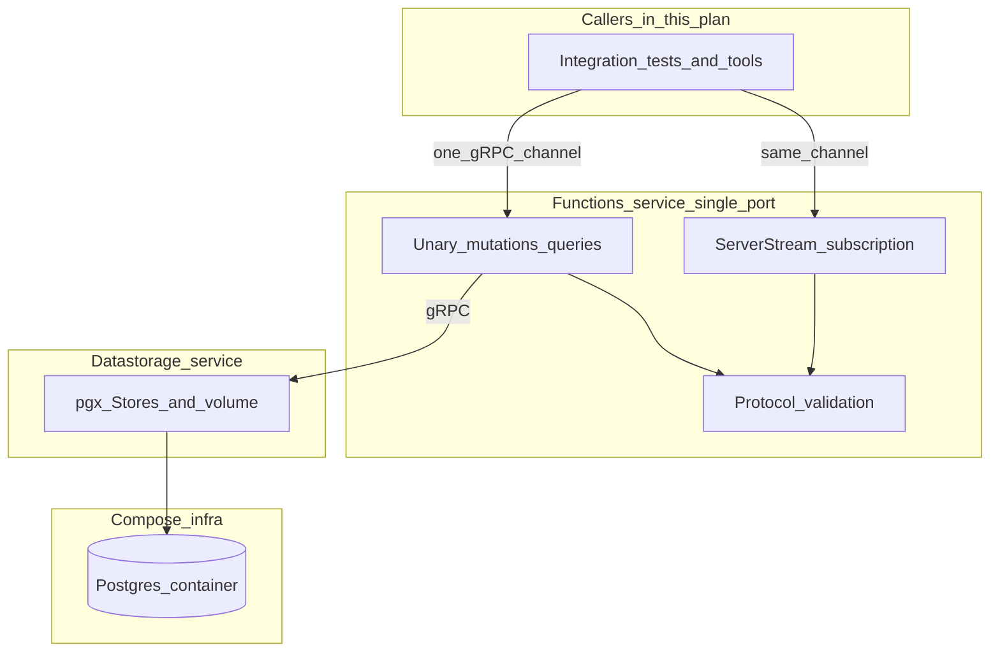

> **Historical plan.** Restructuring is complete. Authoritative decisions live in
> [design-decisions/](../design-decisions/) ADRs 0001–0005. Do not treat this
> file as the source of truth for boundaries or exposure—read the ADRs.
> **Location:** Version-controlled copy of the restructuring plan (Cursor plan id `277b9383`).

# Atlas multi-service restructuring

## Summary

Split Atlas Core into two deployables under `atlas-core/services/`:

- **`atlas-datastorage`** — Postgres, schema-in-code, object volume, storage-integrity workflows
- **`atlas-functions`** — protocol validation, orchestration, idempotent mutations, internal platform gRPC, changefeed stream

One gRPC listen address on functions hosts unary RPCs and `SubscribeMutations` on the same channel. [`atlas.py`](../../../atlas.py) runs codegen before compose.

## Authoritative documentation

| Topic | ADR |
|-------|-----|
| Service boundaries, gRPC entrypoints, changefeed, reconcile | [0002](../design-decisions/0002-service-boundaries-grpc-changefeed.md) |
| Compose reachability and exposure | [0003](../design-decisions/0003-internal-api-exposure-posture.md) |
| HTTP idempotency at the product edge | [0001](../design-decisions/0001-api-boundary-idempotency-versioning.md) |
| Single-tenant deployment | [0004](../design-decisions/0004-single-tenant-deployment-model.md) |
| Reset-first schema-in-code | [0005](../design-decisions/0005-reset-first-schema-in-code.md) |

## Out of scope (deferred)

- **HTTP API + browser SSE** — future `services/api/`; see [vertical-slice-3/SPEC.md](../vertical-slice-3/SPEC.md)
- **Data fusion** — future `services/fusion/` when scoped

## Repo layout (implemented)

- `atlas-core/services/datastorage/` — persistence binary and internal packages
- `atlas-core/services/functions/` — functions binary, changefeed, protocol validation
- `atlas-core/services/shared/` — generated gRPC types, shared model/store helpers
- `atlas-core/proto/` — internal RPC contracts; generated Go in `services/shared/gen/`
