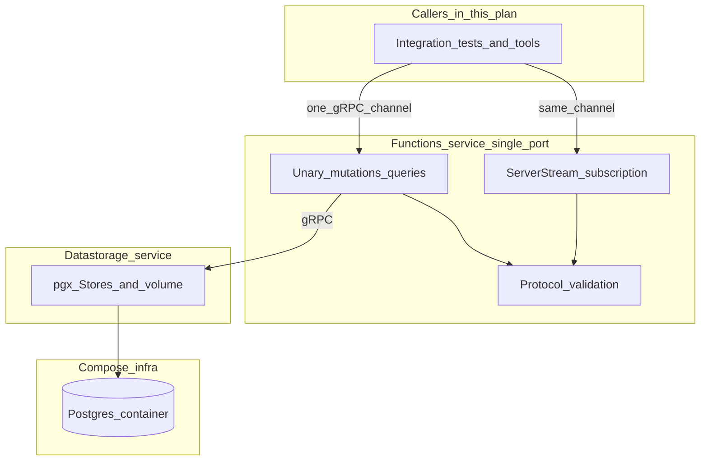

> **Location:** Version-controlled copy of the restructuring plan (Cursor plan id `277b9383`). Update this file when the plan changes.

# Atlas multi-service restructuring (first principles)

## Context: goals, thought process, and decisions

This section records **why** the target architecture looks the way it does, so future readers (including future you) do not have to reverse-engineer intent from directory layout alone.

### What we are optimizing for

- **Replaceability over “microservices for their own sake.”** The main operational goal is to be able to pull out a service, rewrite it, and **slot it back in** using the **same two seams**: stable **inbound** RPC contract and stable **outbound** RPC contracts—without inventing new ad-hoc wiring each time. That pushes us toward **contract-first** design: `.proto` as source of truth, **generated or shared clients**, and **tests that pin those contracts**.
- **Low link count and a simple call graph.** Prefer a **DAG** (directed edges), not a mesh where every service talks to every service. The spine should be obvious: callers only depend on **one downstream** contract in the common case.
- **Speed and simplicity on the hot path.** Internal calls are **gRPC + protobuf** (chosen explicitly over HTTP/JSON for service-to-service). We avoid extra network hops that do not buy a clear boundary—especially **not** putting gRPC between “raw database” and “stores” inside the persistence tier.
- **Honest layering in the repo.** **Each service’s code lives under `atlas-core/services/<service>/`** so “where does this binary’s world live?” is trivially answerable. A **small** amount of shared service code is acceptable under `atlas-core/services/shared/` (logging, env, generated RPC types, tiny helpers), but **not** a growing shared junk drawer that becomes a second monolith.

### What we deliberately did *not* do (and why)

- **Domain-sharded microservices** (separate “entity service,” “task service,” “object service,” etc.) were considered a poor fit for this codebase **today**. Tasks already **join** entities and objects for validation in-process ([`TaskFunctions.validateTaskRuntime`](../../../atlas-core/internal/function/function.go)); splitting that prematurely would scatter ownership and force distributed transactions or fragile sagas without a strong independent scaling driver.
- **A separate “stores service” sitting between Postgres and the persistence binary** was rejected as an extra hop for little gain if it only forwards CRUD. The valuable boundary is **“everything that touches SQL + the object volume lives in one deployable”**—stores remain **modules inside** that service, not a second network service in front of the same DB.
- **A separate “core” process** as another tier in the **data spine** (e.g. API → core → functions) was rejected. “Core” in conversation mapped better to **control-plane / ops** (orchestration, health aggregation) or simply **the repo + `atlas.py` entrypoint**, not a competing domain layer. **No extra core microservice** unless a future need (fleet-wide job registry, multi-tenant ops UI) clearly justifies it.
- **Using one long-lived gRPC stream for *all* traffic** (everything flows through a single pipe) was rejected as **unnecessary complexity** versus **unary RPC for “do work”** plus a **dedicated subscription stream** for push. The user explicitly accepted this compromise.

### Tiered mental model: data plane vs “core”

- **Data plane (in scope for this plan):** persistence (merged DB access + volume + stores) → **functions only** (validation + orchestration + idempotency + **gRPC mutation + subscription surface**). **HTTP API and browser SSE** are **not** part of this plan’s build scope; they land in a **later** plan when you wire a single HTTP edge to the **same** functions gRPC entry (see **One entryway to functions** below).
- **Data fusion** remains **out of the spine** until scoped; sibling service later.
- **Control plane / “how we run it”:** [`atlas.py`](../../../atlas.py) stays **outside** individual service folders as the **startup and local-stack menu**—build, codegen, compose. That matches the desire for a **single obvious entrypoint** rather than scattering “how do I boot the system?” across README fragments.

### Persistence service naming and scope

- The working name **“data storage service”** means **one Go deployable** that owns **Postgres clients, schema init in application code, filesystem object storage, and store implementations**. It does **not** mean embedding the Postgres server binary inside the Go process; **Postgres remains a separate Compose service** (infrastructure), as today.
- **Rationale:** objects in Atlas already span **metadata + files** with rollback/reconcile semantics. Keeping SQL and volume access **in-process** preserves the **fast, simple** story and avoids protobuf between two halves of the same truth.
- **Boundary rule:** gRPC should expose **logical storage capabilities**, not a remote copy of the current Go store interfaces. The current interfaces include Go-only filter functions, `io.Reader` file access, and object workflows that coordinate SQL rows with filesystem folders/manifests. Those are implementation details of the persistence deployable. The function layer should call one storage RPC for one logical storage effect, especially for object operations that must keep metadata, folders, files, and manifest cache consistent.

### Inter-service communication choices

- **gRPC + protobuf** on the **datastorage ↔ functions** seam for this plan. **Future HTTP API** will also talk to functions over gRPC; that work is **explicitly out of scope** here (qualities such as JSON shape, idempotency policy at the edge, and SSE may already be captured in vertical-slice docs, but **no `atlas-api` binary or HTTP server** is part of this restructuring deliverable).
- **Replaceability mechanism:** contracts in-repo + codegen run as part of **bring-up** (see [`atlas.py`](../../../atlas.py)), so swapping an implementation means **implementing the same `.proto`**, not rewriting bespoke glue per consumer.
- **“No versioning” (product stance) vs protobuf reality:** The team wants to avoid **`/v1` / `/v2` URL sprawl** and parallel stacks in development. The plan adopts **lockstep deploy**: one commit builds all images; codegen runs before compose. **Protobuf field numbers and additive field rules** still apply—that is wire evolution discipline, not “API versioning” in the hated sense.

### Boundary design before codegen

- **Do not start with `.proto` syntax.** First write the capability list each service needs, then encode it. This prevents baking today’s package seams into a permanent RPC surface.
- **Datastorage capabilities:** CRUD/list/query operations for entities, objects, tasks, and observations; idempotency claim/status persistence; object metadata + folder lifecycle; object file read/write/append/delete/list; manifest cache update/repair; storage health/readiness; reconciliation.
- **Functions capabilities:** caller-facing mutations and queries; protocol validation; task runtime validation that joins stored asset/catalog state; idempotency semantics; publication of successful domain mutations; subscription RPCs for mutation delivery.
- **Idempotency ownership:** functions own the meaning of idempotent create/replay; datastorage owns the durable idempotency rows. The RPC surface needs explicit claim/complete/fail operations or a deliberately bundled mutation operation. Do not leave this as an accidental side effect of generic SQL/store methods.
- **Error mapping:** define the gRPC status and details mapping before implementation: not found, conflict, version conflict, invalid input/field validation, protocol validation issues, storage failures, database failures, and internal errors.
- **Generated-code policy:** decide whether generated Go is checked in or generated during build only. Either is acceptable, but `atlas.py`, CI, Docker build, and developer docs must follow one policy.

### One entryway to the functions service (clarifies the diagram concern)

- **There must be exactly one network listener / address** for “call Atlas functions” (one `host:port` in Compose, one gRPC `Server` in the process).
- **Unary RPCs** (mutations, queries) and **subscription / server-streaming RPCs** (mutation notifications) are **different RPC methods**, but they are **not** two separate “doors” into the process in the sense of two connections or two ingresses. A future HTTP API—or any other client—should use **one gRPC client `Channel`** to that host:port; HTTP/2 multiplexes many concurrent RPCs, including a long-lived stream, over **one** transport.
- The earlier sketch that showed **HTTP** and **SSE** each arrowing into different boxes inside “functions” was **misleading at the edge**: it looked like **two independent entryways** from the API tier into functions. The corrected story is: **the future API tier has one gRPC dependency on functions**; inside that client, unary calls and `Subscribe…` share one channel. **SSE exists only at the HTTP/browser boundary** in the future API plan—not as a second parallel ingress into the functions process.

### Mutations vs “service / event” concerns (separate in design, one deployable)

- **Intent:** Keep **command/query** paths and **changefeed / event emission** concerns **separate in code and in proto layout** (e.g. distinct packages under `services/functions/internal/…`, and optionally distinct `service` blocks in `.proto` files that are still registered on the **same** gRPC server). That satisfies “service and event stuff is separate, pretty completely” **without** splitting into two physical microservices in this phase.
- **Mechanism (in scope):** After persistence succeeds, **functions** publishes on an internal path that backs a **gRPC server-stream** RPC exposed on that **same** server/port. **Out of scope for this plan:** mapping that stream to **SSE** for browsers (future HTTP API work).
- **Event shape decision:** Atlas Protocol already defines a rich `change_event` document shape. If the functions stream represents resource changes, prefer carrying that protocol event shape so there is one shared event contract. If this plan intentionally wants a smaller refetch-only envelope, name it as an **invalidation hint** instead of a `change_event`, and document how it relates to the protocol event contract.

### Mutation visibility and where publish lives

- **Requirement:** Any successful mutation that goes through the **functions layer** must **not** silently fail to surface to **subscribers of the subscription RPC** (tests today; HTTP clients tomorrow via the future API).
- **Mechanism:** After persistence succeeds, **functions emit** “here is what changed” onto the internal publisher that feeds the **gRPC server-stream** on the **same** functions entrypoint. The **database does not push gRPC** by itself in this design.
- **Alignment with existing notes:** This matches the intent of [`CHANGEFEED-HOOK.md`](../vertical-slice-1/CHANGEFEED-HOOK.md) (publisher on outer success, idempotent replay behavior, no phantom events from store-only partial failure).
- **Reconcile visibility:** If reconciliation moves into datastorage, decide whether repair-created rows or manifest-cache repairs are invisible storage maintenance, service events, or resource change events. Do not let datastorage repair client-visible state while the only subscription path in functions remains unaware of it.
- **Explicit non-goals for this plan:** No reliance on **admin repair scripts** or **other writers bypassing functions**; the project already avoids SQL migration frameworks ([`AGENTS.md`](../../../AGENTS.md)). If that ever changes, you would need **LISTEN/NOTIFY or CDC**—out of scope while the “functions-only writes” rule holds.

### Client and data-lifetime assumptions (product ↔ architecture)

- Much of the data is **short-lived and disposable** (hours to roughly a week). That **lowers the bar** for stream perfection: **at worst, clients reconnect and refetch**—explicitly acceptable.
- **Client behavior baked into expectations** (Atlas Protocol–style consumers, when an HTTP API exists): assume push/SSE-style delivery **will** fail; after **~20–30 seconds**, **manually refresh / refetch** full state. That remains a **first-class reliability strategy** for product docs and SDKs—it is **not** implemented as part of this plan’s deliverables (no HTTP server).

### Scaling and fan-out assumptions

- **Single functions listener** for this plan; horizontal scale of functions is **out of scope**.
- When an HTTP API exists later, **single API replica** remains the working assumption; **SSE fan-out** (many browser tabs, one API process, **one** gRPC channel to functions) stays simple. Experiments like “REST vs WebSocket at the edge” only affect the HTTP tier.

### Fusion

- **Data fusion** is a **separate service** in the long-term picture (different read patterns, different product concerns). This plan **defers** implementation until fusion scope exists; when it lands, it gets its own **`cmd/` + `internal/`** tree under the same contract discipline.

### First-principles “nothing is sacred” boundary

- **Nothing in the current tree layout is immutable**—the restructuring may touch most of `atlas-core/internal` and `cmd`. The target layout is `atlas-core/services/`, with one folder per service and a narrow `services/shared/` folder for truly shared service infrastructure. **Sacred constraints** are narrower: **no migration-framework SQL**, **no mock prod paths**, **Atlas Protocol validation remains a real dependency** ([`atlas-protocol/packages/go`](../../../atlas-protocol/packages/go) via replace), and the **architectural intent** above (merged persistence service; **functions** as the sole mutation boundary and the **only** gRPC entry for domain work in this phase; **changefeed** as a separate concern inside functions; **future** HTTP+SSE edge when you choose to build it).

---

## Target shape (north star) — **in scope for this plan**

- **Data storage service (name TBD, e.g. `atlas-datastorage`)**: One Go deployable under `atlas-core/services/datastorage/` that owns **Postgres access, schema init in code** ([`atlas-core/internal/postgres/schema.go`](../../../atlas-core/internal/postgres/schema.go)), **filesystem object volume** ([`atlas-core/internal/objectstorage/`](../../../atlas-core/internal/objectstorage)), **today’s store implementations** ([`atlas-core/internal/postgres/*_store.go`](../../../atlas-core/internal/postgres/entity_store.go)), and storage-integrity workflows that span SQL + files. **No gRPC boundary inside** between “DB” and “stores”—in-process only.
- **Postgres process**: Stays a **separate container** in Compose ([`atlas-core/docker-compose.yml`](../../../atlas-core/docker-compose.yml)); the Go “data storage” binary is the only writer of SQL + files for normal operation.
- **Functions service (`atlas-functions`)**: Lives under `atlas-core/services/functions/` and owns protocol validation ([`atlas-core/internal/protocolvalidation/`](../../../atlas-core/internal/protocolvalidation/)), idempotency orchestration, and domain rules in [`atlas-core/internal/function/function.go`](../../../atlas-core/internal/function/function.go). Calls data storage **only** via gRPC, but should call **coarse logical storage operations** rather than splitting one object mutation across several remote CRUD/file calls. Exposes **one gRPC listen address** hosting **both** unary command/query RPCs and the **server-streaming subscription** RPC for mutation events (separate **packages/proto services** internally; see Context).
- **[`atlas.py`](../../../atlas.py)**: Remains repo-root entrypoint for codegen + compose (not a deployable “core” service).

---

## Out of scope for this restructuring (recorded for continuity)

- **HTTP API + browser SSE:** not built in this plan; when scheduled, use **one** gRPC `Channel` from `atlas-api` to `atlas-functions` for both unary and `Subscribe…` (SSE only at the HTTP boundary). Product qualities (periodic refetch, DTOs, edge idempotency policy) remain documented in vertical-slice / ADR material until then.
- **Data fusion:** sibling service when scoped.

---

## Principles (constraint checklist)

The narrative for each item lives in **Context** above; this section is the **short checklist** for implementation and review.

- **No SQL migration framework** (per [`AGENTS.md`](../../../AGENTS.md)): schema evolution stays in application code under the data storage service.
- **No mock/stub prod paths**; tests may use fakes.
- **Lockstep deploy / “no URL versioning”**: one `.proto` source of truth per internal seam; **protobuf field-number discipline** instead of `/v1` routing; [`atlas.py`](../../../atlas.py) (or a thin script it calls) runs **codegen before `docker compose --build`** so images always match the same tree.
- **Mutation visibility (in scope):** Align with [`CHANGEFEED-HOOK.md`](../vertical-slice-1/CHANGEFEED-HOOK.md)—**publish only on function-layer outer success**. Wire the publisher to the **gRPC server-stream** on the functions service; **subscribers in this plan** are integration tests, dev tools (`grpcurl`), or temporary harnesses—not a production HTTP API.
- **RPC surface is not package mirroring:** do not expose Go-only concepts such as filter functions or `io.Reader` semantics in proto; translate them into explicit request/response messages and streaming RPCs where needed.

## Repo and module layout (mirrors services)

Within [`atlas-core/`](../../../atlas-core/) (module [`atlas-core/go.mod`](../../../atlas-core/go.mod)):

- **Service root:** `services/` is the top-level home for deployable service code.
- **This plan:** `services/datastorage/` and `services/functions/`.
- **Each service owns its world:** put each service's binary entrypoint, internal packages, transports, adapters, and tests under that service folder, e.g. `services/datastorage/cmd/atlas-datastorage/main.go`, `services/datastorage/internal/...`, `services/functions/cmd/atlas-functions/main.go`, and `services/functions/internal/...`.
- **Future HTTP API plan:** `services/api/` (not created in this restructuring unless scope expands).
- **Future fusion plan:** `services/fusion/` when scoped.
- **Shared service infrastructure:** `services/shared/` is allowed for generated RPC code, logging/env helpers, shared error/status mapping, and tiny cross-service utilities. Keep it narrow and boring; do not recreate a second monolith under `services/shared`.
- **Existing `internal/` packages:** service-owned code moves out of today’s flat `internal/{app,config,function,postgres,objectstorage,...}` split and into the owning service folder. Any package left under top-level `internal/` must have an explicit reason during the restructure.
- **Changefeed / subscription code:** keep it clearly named inside `services/functions/internal/...` (for example `services/functions/internal/changefeed/...`) so command paths and event paths stay separable in the tree.
- **Contracts:** e.g. `proto/atlas/` with `buf.gen.yaml` / `buf.yaml` (or `protoc` + `go generate`)—**generated Go** in `services/shared/gen/...` imported by **datastorage + functions** (and later `api` when it exists). Keep [`atlas-protocol/packages/go`](../../../atlas-protocol/packages/go) as the **replace** dependency for validation only; internal RPC protos stay separate from protocol JSON-schema concerns.

**Major optional change:** introduce a **Go workspace** (`go.work`) at repo root if you later split `atlas-core` into multiple modules; **start with one module** to reduce churn.

## gRPC surface (minimal links)

- **Data storage gRPC:** Narrow RPCs that expose **capabilities** the function layer needs (not raw SQL and not a 1:1 remote copy of [`internal/store/store.go`](../../../atlas-core/internal/store/store.go)). Implement handlers with existing postgres/objectstorage code under `services/datastorage/internal/...`. For object operations, prefer single logical RPCs that keep metadata, filesystem, and manifest cache consistent inside datastorage.
- **Functions gRPC (single listen addr):** Unary methods for mutations/queries; **one** `SubscribeMutations`-style **server-streaming** RPC on the **same** server for changefeed. **Subscribers in this plan:** tests and tooling; **future** HTTP API opens **one** client `Channel` and uses both unary and stream RPCs over it. The stream carries either Atlas Protocol `change_event` documents or explicitly named invalidation hints; choose before codegen.
- **Errors:** Standardize **gRPC status codes** + small structured `details` protobuf for field-level issues (mirror [`internal/model/errors.go`](../../../atlas-core/internal/model/errors.go) concepts). Preserve protocol validation issue shape (`field`, `code`, `message`) without flattening it into opaque strings.

## Implementation phases (strangler, not big-bang rewrite)

### Phase 0 — Boundary contract decisions

- Write a short boundary table before `.proto` work:
  - functions RPCs exposed to this plan's callers
  - datastorage RPCs consumed by functions
  - which operations are unary, server-streaming, or byte-streaming
  - which operations own cross-resource consistency internally
- Decide the event payload: Atlas Protocol `change_event` vs smaller invalidation hint. Default recommendation: use protocol `change_event` for resource mutation streams; use a separate hint type only if the stream is deliberately refetch-only.
- Decide reconcile visibility: no subscriber-visible event, service event, or resource change event. Record the rule before moving reconcile into datastorage.
- Decide idempotency RPC shape: separate claim/complete/fail methods vs bundled create methods. Keep functions responsible for replay semantics either way.
- Define the error/status mapping table and generated-code check-in policy.
- Verification: reviewers can inspect this table and identify every future RPC before codegen exists.

### Phase 1 — Contracts and codegen spine

- Add **Buf or protoc** pipeline; document it in [`README.md`](../README.md).
- Extend [`atlas.py`](../../../atlas.py) `start` path: **invoke codegen** before `docker compose up --build` (fail fast if `protoc`/`buf` missing with a clear message).
- Update [`.github/workflows/ci.yml`](../../../.github/workflows/ci.yml) and [`.github/workflows/integration.yml`](../../../.github/workflows/integration.yml) to run the same codegen/check command as `atlas.py` (or rely on Docker build stage that runs codegen—pick one place as **source of truth** to avoid drift).

### Phase 2 — Directory reorg + persistence gRPC server

- Create `services/datastorage/` and move postgres/objectstorage/store implementations under `services/datastorage/internal/...`; add `services/datastorage/cmd/atlas-datastorage/main.go`.
- Implement gRPC server; keep **schema init** on startup (today’s pattern in [`internal/app/app.go`](../../../atlas-core/internal/app/app.go)).
- Move object metadata/folder/file/manifest consistency workflows into datastorage RPC handlers so functions does not perform distributed rollback across multiple remote calls.
- **Object reconcile** stays with persistence (it is storage integrity work tied to [`ObjectFunctions.Reconcile`](../../../atlas-core/internal/function/function.go) today—either expose `Reconcile` as an internal RPC called from functions on a schedule, or run the ticker **inside persistence**; default recommendation: **persistence owns periodic reconcile** since it owns files + rows). Apply the Phase 0 reconcile visibility rule when repairs change client-visible state.

### Phase 3 — Functions service extraction

- Create `services/functions/` and move `internal/function` + `internal/protocolvalidation` + relevant model usage under `services/functions/internal/...`; add `services/functions/cmd/atlas-functions/main.go`.
- Replace in-process store calls with **generated gRPC client** to persistence, using the Phase 0 capability RPCs rather than one remote call per old store helper.
- Port tests: unit tests with fakes; integration tests using Compose **services** network (functions container talks to persistence container).

### Phase 4 — Changefeed / publisher wiring (still **no** HTTP API)

- Implement the **Publisher seam** from [`CHANGEFEED-HOOK.md`](../vertical-slice-1/CHANGEFEED-HOOK.md): `Publish` on every outer mutation success in functions; **no-op** in tests where needed.
- Connect publisher to the **server-stream** RPC handler on the **same** gRPC server as unary methods. Emit the Phase 0 event shape. Verify with integration tests and/or `grpcurl`—**no** SSE, **no** `atlas-api` binary in this phase.

### Phase 5 — Docker, `atlas.py`, ops

- Replace single `atlas-core` service in [`atlas-core/docker-compose.yml`](../../../atlas-core/docker-compose.yml) with **two app services** (`atlas-datastorage`, `atlas-functions`) + postgres + volumes; **depends_on** ordering: postgres healthy → datastorage healthy → functions.
- Multi-stage [`atlas-core/Dockerfile`](../../../atlas-core/Dockerfile): **two images** or one Dockerfile with two targets.
- Healthchecks per binary (extend or replace [`cmd/atlas-core/main.go`](../../../atlas-core/cmd/atlas-core/main.go) `--healthcheck` pattern per service).
- Update [`AGENTS.md`](../../../AGENTS.md) “Where to find things” to describe new layout.

### Phase 6 — Docs and ADRs

- Add/update ADRs for: internal **datastorage ↔ functions** gRPC boundaries; **single gRPC entry** to functions; **changefeed** as a separate internal concern; **deferred** HTTP+SSE API plan (link to vertical-slice-3 / [`0001-api-boundary-idempotency-versioning.md`](../design-decisions/0001-api-boundary-idempotency-versioning.md) as *design* reference—no requirement to implement HTTP to close this restructuring).
- Reconcile the Vertical Slice 3 transport direction with this plan. If this restructuring lands first, VS3 should describe HTTP JSON as the future public edge over the functions gRPC boundary, not as the immediate next implementation path.
- Refresh vertical slice specs where they still describe a **single monolithic binary** (honesty pass).

### Phase 7 (later) — Data fusion

- New `services/fusion/` when scoped; same contract discipline.

## Risks and mitigations

- **Latency / partial failures** across gRPC: keep unary timeouts explicit; persistence methods should stay **idempotent** where they already are (objects/tasks).
- **Stream reliability:** ephemeral data + future client refetch policy tolerate gaps; document reconnect behavior for **stream subscribers** (tests today; HTTP API later).
- **Codegen drift**: single codegen entry from `atlas.py` + CI identical command.
- **Large move PRs**: land Phase 1–2 behind feature branches or stacked PRs per phase to keep reviewable diffs.

## What this plan intentionally does not do

- **Build an HTTP API or browser SSE** (that is a separate future plan; qualities may already be captured in docs).
- Embed Postgres inside the persistence Go binary (not required for your goals).
- Introduce Kafka/NATS for the primary path (only revisit if API or functions must scale horizontally).
- Rewrite Atlas Protocol in protobuf (keep current Go replace module for validation).
